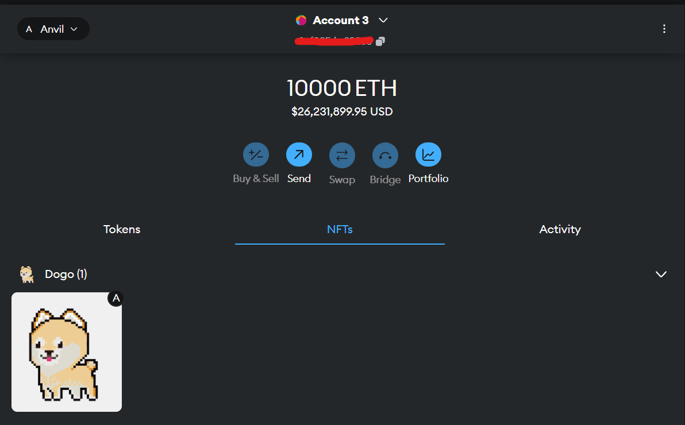
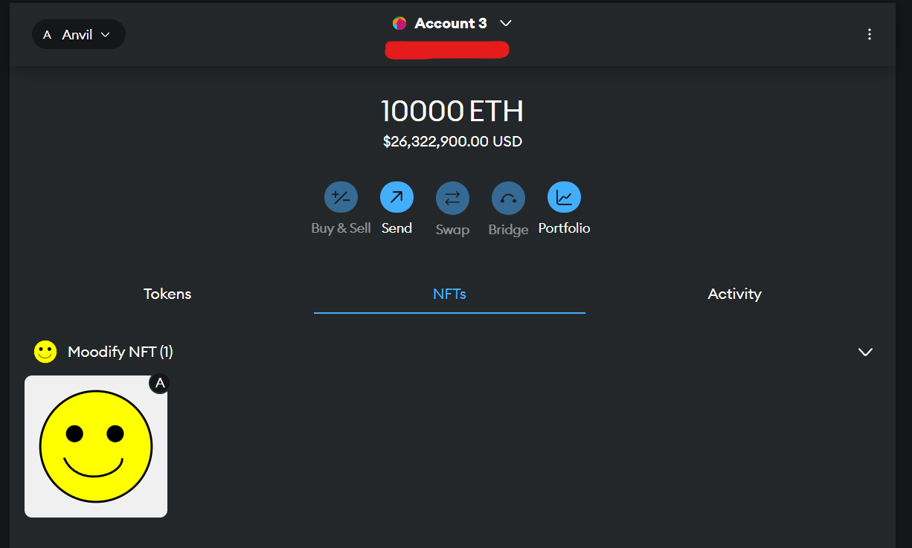

## NFT_Collection
<p>NFT_Collection is a smart contract project for dynamic NFT collection.</p>
<p>Accounts can mint their own NFTs and then import them in their wallets.</p>
<p>The doggie NFT is stored on IPFS Network and the Moodify NFT is stored directly on-chain.</p>

<ul>
    <strong>Important:</strong>
    <li>Not real ether or private keys are used.</li>
    <li>This project can be deployed both to an in-memory local blockchain like Anvil or Sepolia Testnet.</li>
    <li>If you want to use Sepolia Testnet or any other, you have to make an account and use your keys to sign transactions.</li>
    <li>To use Sepolia you have to have some Sepolia Test Eth which can be aquired from a Faucet.</li>
    <li>Anvil would be easier to test with since it is a local Ethereum node provided by Foundry.</li>
    <li>The base deploy is for Anvil with a fake account and private key.</li>
    <li>To import your minted NFT you need to add the account to your Metamask and switch to Anvil network.</li>
    <li>If you don't have Anvil network you can add it manualy through metamask wallet.</li>
</ul>

<p></p>

<p>For further info, please read the whole file, so you can interact with the project efficiently.</p>

<p><strong>NOTE:</strong> you need to have WSL and Ubuntu in order to execute the project on Windows.</p>

## Tech Stack

<p>
  
  
  
  
</p>

## Foundry

**Foundry is a blazing fast, portable and modular toolkit for Ethereum application development written in Rust.**

Foundry consists of:

-   **Forge**: Ethereum testing framework (like Truffle, Hardhat and DappTools).
-   **Cast**: Swiss army knife for interacting with EVM smart contracts, sending transactions and getting chain data.
-   **Anvil**: Local Ethereum node, akin to Ganache, Hardhat Network.
-   **Chisel**: Fast, utilitarian, and verbose solidity REPL.

## Documentation

https://book.getfoundry.sh/

## Usage

### Clone
```shell
$ git clone https://github.com/GeorgiKostadinovPro/NFT_Collection
```

### Scripts 
Review the <a href="./Makefile">Makefile</a> to easily interact with the project.

### Metamask Import
<p>After you connected to Metamask with account from Anvil and set the target network to Anvil you will be able to mint and switch tokens.</p>
<p>To mint or switch just be sure to execute the scripts properly and unable the NFT Media on Metamask.</p>

<p>Here is a Happy NFT.</p>


<p>After Switching the NFT you can import it again.</p>


### Help

```shell
$ forge --help
$ anvil --help
$ cast --help
```